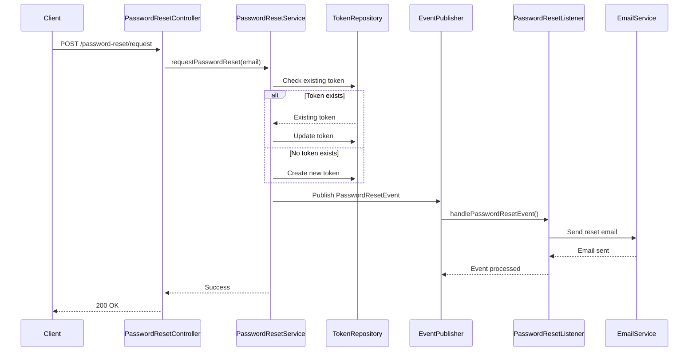
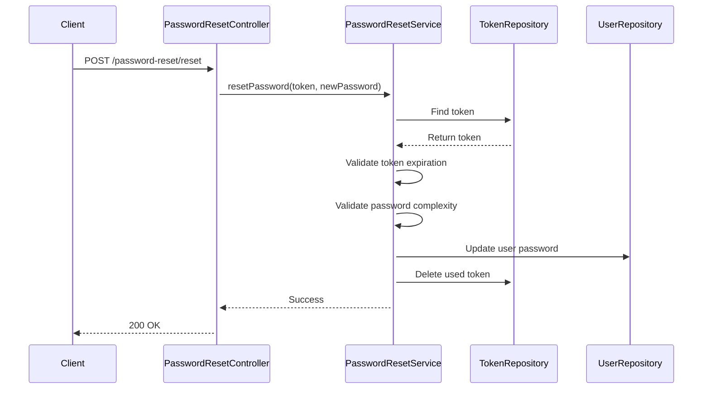

# Password Reset System Architecture

## Overview
The password reset system provides a secure way for users to reset their forgotten passwords. It follows a token-based approach with email verification to ensure security.

## Architecture

### Components

1. **PasswordResetController**
   - REST endpoints for password reset functionality
   - Handles HTTP requests and responses
   - Input validation and error handling

2. **PasswordResetService**
   - Core business logic for password reset operations
   - Token generation and validation
   - Password complexity enforcement
   - Transaction management

3. **PasswordResetToken Entity**
   - JPA entity for storing reset tokens
   - Contains token string, expiration date, and user association
   - Implements token expiration logic

4. **PasswordResetTokenRepository**
   - JPA repository for token persistence
   - Custom queries for token lookup

5. **PasswordResetListener**
   - Handles asynchronous email sending
   - Listens for password reset events
   - Sends password reset emails with secure links

6. **PasswordResetEvent**
   - Event class for password reset requests
   - Carries user and token information

## Flow

### 1. Password Reset Request


### 2. Password Reset Confirmation


## Security Features

1. **Token Security**
   - Tokens are randomly generated UUIDs
   - 24-hour expiration
   - Single-use only
   - Stored securely in the database

2. **Password Requirements**
   - Minimum 8 characters
   - At least one digit
   - At least one lowercase letter
   - At least one uppercase letter
   - At least one special character (@#$%^&+=)
   - No whitespace allowed

3. **Email Security**
   - Secure HTTPS links in emails
   - No sensitive information in emails
   - Rate limiting (implied by token expiration)

## API Endpoints

### Request Password Reset
```
POST /user/api/v1/password-reset/request
Content-Type: application/json

{
    "emailAddress": "user@example.com"
}
```

### Reset Password
```
POST /user/api/v1/password-reset/reset
Content-Type: application/x-www-form-urlencoded

token=abc123&newPassword=NewPass123#
```

## Error Handling

- **400 Bad Request**: Invalid input format or missing parameters
- **404 Not Found**: User not found
- **400 Bad Request**: Invalid or expired token
- **400 Bad Request**: Password doesn't meet requirements
- **400 Bad Request**: Account is disabled

## Testing

### Unit Tests
- `PasswordResetServiceImplUnitTests`: Tests service layer logic
- `PasswordResetEventListenerUnitTests`: Tests email notification logic

### Integration Tests
- `PasswordResetIntegrationTests`: End-to-end flow testing
  - Token generation and validation
  - Password complexity enforcement
  - Error scenarios
  - Concurrency handling

## Dependencies

- Spring Boot Web
- Spring Data JPA
- Spring Security
- JavaMailSender
- H2 Database (for testing)
- JUnit 5
- Mockito

## Configuration

Application properties:
```properties
# Token expiration in minutes (default: 1440 = 24 hours)
app.security.password-reset.token-expiration=1440

# Frontend reset password URL (used in email)
app.frontend.reset-password-url=http://localhost:5173/reset-password

# Email settings
spring.mail.host=smtp.example.com
spring.mail.port=587
spring.mail.username=your-email@example.com
spring.mail.password=your-email-password
spring.mail.properties.mail.smtp.auth=true
spring.mail.properties.mail.smtp.starttls.enable=true
```
