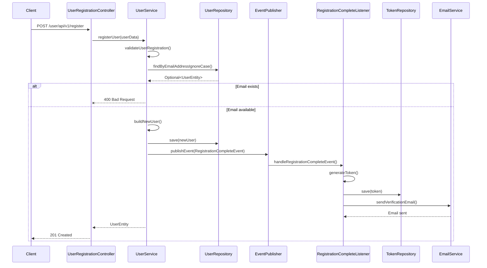
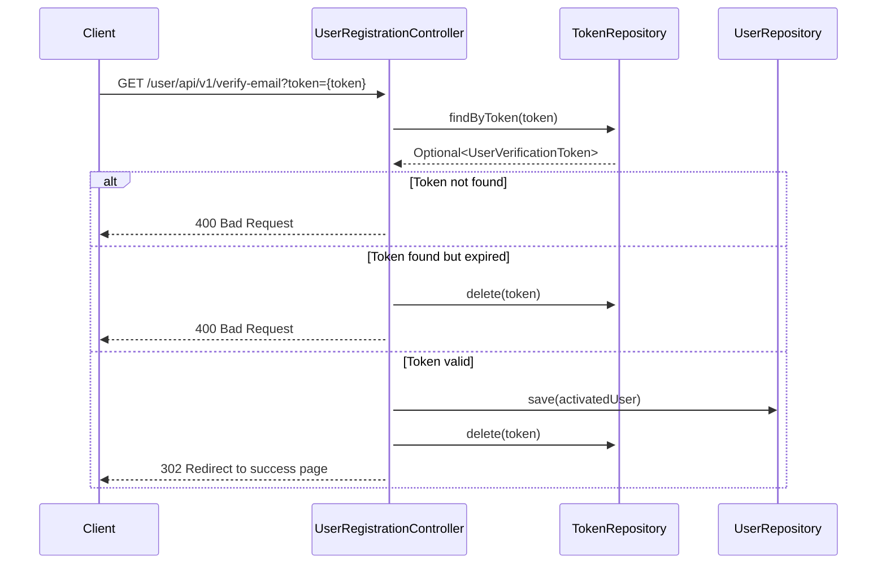

# User Registration System

## Overview
The User Registration System provides a secure and robust way for users to create accounts and verify their email addresses. It follows a token-based email verification flow to ensure account security and validity.

## Architecture

### Components

1. **UserRegistrationController**
   - Handles HTTP requests for user registration and email verification
   - Exposes RESTful endpoints
   - Manages request/response handling and validation

2. **UserService**
   - Implements core business logic for user management
   - Handles user registration, validation, and account management
   - Implements Spring Security's UserDetailsService

3. **UserEntity**
   - JPA entity representing a user in the system
   - Implements Spring Security's UserDetails
   - Contains user details and account status

4. **UserVerificationToken**
   - JPA entity for email verification tokens
   - Links tokens to users with expiration
   - One-to-one relationship with UserEntity

5. **RegistrationCompleteListener**
   - Handles asynchronous email sending
   - Listens for registration events
   - Manages token generation and storage

6. **UserRepository**
   - JPA repository for UserEntity
   - Custom queries for user lookup

7. **UserVerificationTokenRepository**
   - JPA repository for verification tokens
   - Custom queries for token management

## Registration Flow



## Email Verification Flow



## Security Features

1. **Account Security**
   - Accounts are locked and disabled by default until email verification
   - Passwords are hashed using BCrypt
   - Email verification required before first login

2. **Data Validation**
   - Input validation on all endpoints
   - Email format validation
   - Duplicate email prevention
   - Required field validation

3. **Token Security**
   - Randomly generated UUID tokens
   - 24-hour expiration
   - Single-use only
   - Automatic cleanup of expired tokens

## API Endpoints

### Register New User
```
POST /user/api/v1/register
Content-Type: application/json

{
    "firstName": "John",
    "lastName": "Doe",
    "dateOfBirth": "1990-01-01",
    "gender": "MALE",
    "phoneNumber": "1234567890",
    "emailAddress": "john.doe@example.com",
    "password": "SecurePass123#",
    "addressLineOne": "123 Main St",
    "townOrCity": "Anytown",
    "postcode": "12345",
    "county": "Anycounty",
    "country": "Country"
}
```

### Verify Email
```
GET /user/api/v1/verify-email?token={verificationToken}
```

## Data Model

### UserEntity
```java
@Entity
@Table(name = "users")
public class UserEntity implements UserDetails {
    private Long id;
    private String firstName;
    private String lastName;
    private LocalDate dateOfBirth;
    private String gender;
    private String phoneNumber;
    @Column(unique = true)
    private String emailAddress;
    private String password;
    private String addressLineOne;
    private String addressLineTwo;
    private String townOrCity;
    private String postcode;
    private String county;
    private String country;
    @Enumerated(EnumType.STRING)
    private UserRole userRole;
    private boolean locked = true;     // Locked until email verification
    private boolean enabled = false;    // Disabled until email verification
    // Getters, setters, and UserDetails methods
}
```

### UserVerificationToken
```java
@Entity
@Table(name = "verification_tokens")
public class UserVerificationToken {
    @Id
    @GeneratedValue(strategy = GenerationType.IDENTITY)
    private Long id;
    private String token;
    @OneToOne
    @JoinColumn(nullable = false, name = "user_id")
    private UserEntity user;
    private LocalDateTime expiryDate;
    // Getters and setters
}
```

## Configuration

### Application Properties
```properties
# Email settings
spring.mail.host=smtp.example.com
spring.mail.port=587
spring.mail.username=your-email@example.com
spring.mail.password=your-email-password
spring.mail.properties.mail.smtp.auth=true
spring.mail.properties.mail.smtp.starttls.enable=true

# Token expiration in hours
app.registration.token-expiration=24

# Frontend verification URL (used in email)
app.frontend.verification-url=http://localhost:5173/verify-email
```

## Error Handling

- **400 Bad Request**: Invalid input format or missing parameters
- **400 Bad Request**: Email already registered
- **400 Bad Request**: Invalid or expired verification token
- **500 Internal Server Error**: Email sending failure

## Testing

### Unit Tests
- `UserServiceUnitTests`: Tests service layer logic
- `RegistrationCompleteListenerUnitTests`: Tests email notification logic

### Integration Tests
- `UserRegistrationIntegrationTests`: End-to-end flow testing
  - Registration with valid/invalid data
  - Email verification flow
  - Error scenarios
  - Concurrency handling

## Dependencies

- Spring Boot Web
- Spring Data JPA
- Spring Security
- JavaMailSender
- H2 Database (for testing)
- JUnit 5
- Mockito
